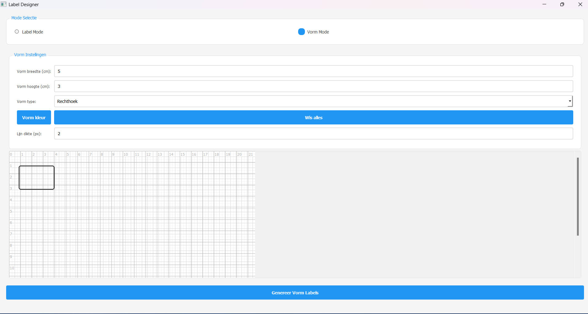

# Label Designer

Label Designer is een tool om labels en vormen te ontwerpen en te genereren. Met deze tool kunt u eenvoudig labels maken met aangepaste afmetingen, tekst en vormen. De tool biedt ook de mogelijkheid om de dikte van de lijnen aan te passen en de kleur van de vormen te wijzigen.

## Installatie

Om de tool te gebruiken, moet Python op uw systeem zijn geïnstalleerd. U kunt Python eenvoudig downloaden en installeren via de [Microsoft Store](https://apps.microsoft.com/store/detail/python-311/9NRWMJP3717K).

De benodigde pakketten worden automatisch geïnstalleerd bij het eerste gebruik van de tool.

## Gebruik

1. Dubbelklik op het bestand `tool.py` om de tool te starten.
2. Selecteer de gewenste modus: **Label Mode** of **Vorm Mode**.
3. In **Label Mode**:
   - Stel de afmetingen van de labels in.
   - Pas de marge tussen de labels en de buitenmarge aan.
   - Voer de tekst in die op de labels moet worden weergegeven.
4. In **Vorm Mode**:
   - Kies de afmetingen van de vormen.
   - Selecteer het type vorm (rechthoek, cirkel of driehoek).
   - Pas de kleur van de vorm en de dikte van de lijnen aan.
   - Stel de marge tussen de vormen in.
   - Optioneel: Vink "Handmatige layout instellingen" aan om zelf het aantal rijen en kolommen te bepalen.
5. Klik op de knop **Genereer Labels** om de labels of vormen te genereren.

## Functies

- **Label Mode**: Ontwerp en genereer labels met aangepaste afmetingen en tekst.
- **Vorm Mode**: 
  - Ontwerp en genereer vormen met aangepaste afmetingen, type, kleur en lijndikte.
  - Automatische of handmatige indeling van vormen op het A4-vel.
  - Aanpasbare marges tussen vormen.
  - Real-time preview van vorm afmetingen.
- **Lijndikte**: Pas de dikte van de lijnen aan voor de vormen.
- **Kleur**: Kies de kleur van de vormen.
- **Sneltoetsen**: 
  - `Ctrl+G`: Genereer labels/vormen
  - `Ctrl+D`: Wis huidige vorm

## Voorbeeld

Hier is een voorbeeld van hoe de tool eruitziet:

## Ondersteuning

Als u problemen ondervindt of vragen heeft, neem dan contact op met [Arjan den Hartog](https://arjandenhartog.com/).
